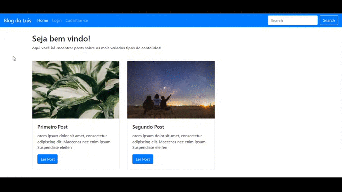

<h2 align="center">
  Simple Blog
</h2>

# 🚀 About
Simple application to teaching about conceptions from AdonisJS and little tools for init your journey into the programming world.

# 🎨 Layout
<h4 align="center">

  

</h4>

# Techs
- [AdonisJS][adonisjs]
- [Bootstrap][bootstrap]
- [NodeJS][nodejs]

# :information_source: How To Use

```bash

# Clone this repository

$ git clone https://github.com/luisrodriguesds/blog-js.git

# Go into the repository

$ cd blog

# Install packages

$ npm install

# Configure .env with your database information

$ gedit .env

# Run the migrations

$ adonis migration:run

# Run start and enjoy

$ adonis serve --dev

# Enjoy!

```

After this, you can develop and contact my from see your contrib and add credits for you in this repository :smile: 

---

Made with ♥ by Luis Rodrigues [Visit my LinkedIn!](https://www.linkedin.com/in/luis-rodrigues-064875174/) :rocket:
